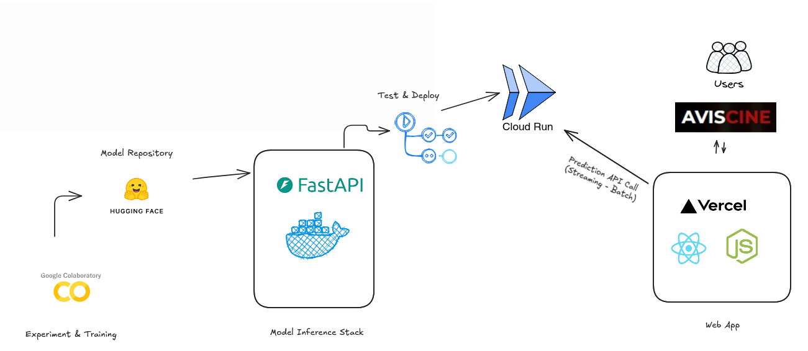

# Sentiment analysis



Projet d'Analyse de sentiment avec BERT et FastAPI 

Ce projet est basé sur un entrainement et déploiement d'un modèle de classification binaire en utilisant les Transformers via BERT  et FastAPI.

Application  web : https://cine-s4gn.vercel.app

API : https://g2-sentiment-analysis-844747804346.us-central1.run.app/docs

Rapport final : https://docs.google.com/document/d/1lDZlo5FaIMBxwYxUze4pZZXf0Ag2MjEX/edit?usp=drivesdk&ouid=109115452173640326314&rtpof=true&sd=true

PowerPoint : https://docs.google.com/presentation/d/1lLk-iH9e87zmPT-Fjl8XBUeJGmiEOiJX/edit?usp=drivesdk&ouid=109115452173640326314&rtpof=true&sd=true


Notebook : https://colab.research.google.com/drive/14fYRsI99CuV09egAwon33Gcwqnfdu6iI#scrollTo=OCNDEYHyx9ZA
## Development Requirements

- Python >= 3.10
- Pip
- Poetry (Python Package Manager)

### M.L Model Environment

```sh
MODEL_PATH=./ml/model/
MODEL_NAME=model.pkl
```
### ENV Variables

Set `HF_TOKEN` and `HF_API_URL` in your environment variables


### Update `/predict`

To update your machine learning model, add your `load` and `method` [change here](app/api/routes/predictor.py#L19) at `predictor.py`

## Installation

```sh
python -m venv venv
source venv/bin/activate
make install
```

## Runnning Localhost

`make run`

## Deploy app

`make deploy`

## Running Tests

`make test`

## Access Swagger Documentation

> <http://localhost:8080/docs>

## Access Redocs Documentation

> <http://localhost:8080/redoc>

## Project structure

Files related to application are in the `app` or `tests` directories.
Application parts are:

    app
    |
    | # Fast-API stuff
    ├── api                 - web related stuff.
    │   └── routes          - web routes.
    ├── core                - application configuration, startup events, logging.
    ├── models              - pydantic models for this application.
    ├── services            - logic that is not just crud related.
    ├── main-aws-lambda.py  - [Optional] FastAPI application for AWS Lambda creation and configuration.
    └── main.py             - FastAPI application creation and configuration.
    |
    | # ML stuff
    ├── data             - where you persist data locally
    │   ├── interim      - intermediate data that has been transformed.
    │   ├── processed    - the final, canonical data sets for modeling.
    │   └── raw          - the original, immutable data dump.
    │
    ├── notebooks        - Jupyter notebooks. Naming convention is a number (for ordering),
    |
    ├── ml               - modelling source code for use in this project.
    │   ├── __init__.py  - makes ml a Python module
    │   ├── pipeline.py  - scripts to orchestrate the whole pipeline
    │   │
    │   ├── data         - scripts to download or generate data
    │   │   └── make_dataset.py
    │   │
    │   ├── features     - scripts to turn raw data into features for modeling
    │   │   └── build_features.py
    │   │
    │   └── model        - scripts to train models and make predictions
    │       ├── predict_model.py
    │       └── train_model.py
    │
    └── tests            - pytest

## GCP

Deploying inference service to Cloud Run

### Authenticate

1. Install `gcloud` cli
2. `gcloud auth login`
3. `gcloud config set project <PROJECT_ID>`

### Enable APIs

1. Cloud Run API
2. Cloud Build API
3. IAM API

